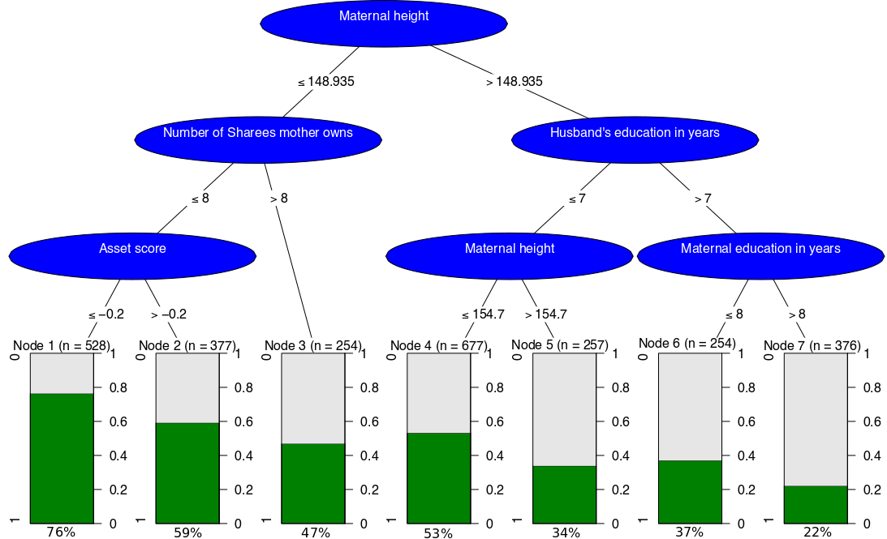

```{r setup, include=FALSE}
knitr::opts_chunk$set(echo = TRUE)
```

## Assignment 1

The resulting PDF picture is shown as *Figure 1*.


{ width=75% }


## Assignment 2

#### Question 1

```{r 2.1, message=FALSE, warning=FALSE}
data <- read.table("SENIC.txt")
names(data) <- c("ID","Length of Stay","Age","Infection Risk","Routine Culturing Ratio","Routine Chest X-Ray","Number of Beds","Medschool Affiliation","Region","Avg. Daily Census","Number of Nurses","Facilities")
```

#### Question 2

```{r 2.2}
outliers <- function(vec){
  quantiles <- quantile(vec, c(0.25,0.75))
  pos<-which(vec>(quantiles[2]+1.5*(quantiles[2]-quantiles[1]))|vec<(quantiles[1]-1.5*(quantiles[2]-quantiles[1])))
  return(pos)
}
```

#### Question 3

```{r 2.3}
library(ggplot2)
plot <- ggplot(data = data, aes(x=`Infection Risk`)) + geom_density() + geom_point(data=data[outliers(data$`Infection Risk`),],
                                                                                   aes(x=data$`Infection Risk`[outliers(data$`Infection Risk`)]),y=0, shape="diamond",size=3)
print(plot)
```

The distribution of infection risk among the hospitals appears to be close to a normal distribution. Most of the hospitals in the sample bear infection risks between 4% and 5%, while the descent of the curve is steeper on the right side of the maximum. Also, the outliers on the right-hand side seem to be farther away from the non-outliers than the ones on the left-hand side.

#### Question 4

```{r 2.4}
library(gridExtra)
quant_vars <- c("Length of Stay","Age","Infection Risk","Routine Culturing Ratio","Routine Chest X-Ray","Number of Beds","Avg. Daily Census","Number of Nurses","Facilities")
q.num <- which(is.element(names(data),quant_vars))
plot_list <- lapply(q.num, function(q.num) ggplot(data=data, aes(x=data[,q.num])) + geom_density() + geom_point(data=data[outliers(data[,q.num]),],aes(x=data[outliers(data[,q.num]),q.num]),y=0, shape="diamond",size=3) + xlab(names(data)[q.num])) 
grid <- arrangeGrob(grobs = plot_list)
plot(grid)
```

The distributions for the number of beds, the number of nurses and the average daily census look fairly
similar. They also seem to be closely related in terms of outliers, both their number and their pattern
of occurence. This is reasonable, since all these variables basically measure the same underlying concept:
The size of the hospital. 
 
Also, the graphs for Routine Culturing Ratio and Infection risk show roughly the same number of outliers.
This could be due to the fact, that hospitals which are aware of the high infection risk among their
patients might perform more routine checks.

#### Question 5

```{r 2.5}
plot2 <- ggplot(data=data, aes(y=`Infection Risk`, x=`Number of Nurses`, col=`Number of Beds`)) + geom_point()
print(plot2)
```

The Scatterplot allows us to assess the correlation between the two variables: There seems to be an
upwards trends, such that the number of nurses increases with the infection risk. This apparently 
does not hold for larger hospitals, which have significantly higher number of nurses, but only show
average slightly increased infection risks.

Some possible shortcomings of having a color scale are the fact, that coulors might not be as intuitively
interpretable as axis and could therefore lead to misinterpretation of the information. In addition to
that, it can be hard to distinguish the different shades of a color, especially for colorbling people.

#### Question 6

```{r 2.6,message=FALSE}
library(plotly)
ggplotly(plot)
```

The graph is now interactive, i.e. we can zoom in and inspect certain areas mor closely. Also, we can
use the mouse to hover over the graph and obtain information on the numeric data underlying the graph.
This allows for moch more precise interpretations.

Because of that, we can now say, that the difference between the lowest (1.3%) and the highest (7.8%) 
infection risk is 6.5 percentage points. This also means, that the risk of being infected in the
"worst" hospital is six times higher than in the "best" one.

#### Question 7

```{r 2.7,message=FALSE}
library(dplyr)
InfRisk_quantiles <- quantile(data$`Infection Risk`, c(0.25,0.75))

InfRisk_plot <- data %>% plot_ly(x = ~`Infection Risk`, type="histogram") %>% 
  filter(is.element(`Infection Risk`, data$`Infection Risk`[outliers(data$`Infection Risk`)])) %>% 
  add_markers(x = ~`Infection Risk`, y=~0, marker=list(symbol=32, size=9)) %>% layout(xaxis=list(title="Infection Risk"))

InfRisk_plot
```

#### Question 8

```{r 2.8}
library(shiny)

outliers <- function(vec){
  quantiles <- quantile(vec, c(0.25,0.75))
  pos<-which(vec>(quantiles[2]+1.5*(quantiles[2]-quantiles[1]))|vec<(quantiles[1]-1.5*(quantiles[2]-quantiles[1])))
  return(pos)
}

ui <- fluidPage(
  checkboxGroupInput("DisplayChoices","Select Variables:", c("Length of Stay","Age","Infection Risk","Routine Culturing Ratio","Routine Chest X-Ray","Number of Beds","Avg. Daily Census","Number of Nurses","Facilities")),
  sliderInput("BWSlider","Choose Bandwidth: ",0.5,10,0.5),
  verbatimTextOutput("SelectMessage"),
  plotOutput("GridPlot")
)

server <- function(input, output){
  output$GridPlot <- renderPlot({
    validate(
      need(input$DisplayChoices, "Please select at least one item.")
    )
    
    plot_list <- lapply(input$DisplayChoices, function(varname) ggplot(data=data, aes(x=data[,varname])) + geom_density(bw=input$BWSlider) + geom_point(data=data[outliers(data[,varname]),],aes(x=data[outliers(data[,varname]),varname]),y=0, shape="diamond",size=3) + xlab(varname))
    grid <- arrangeGrob(grobs = plot_list)
    plot(grid)
    })
}

shinyApp(ui=ui, server=server)
```

With increasing bandwidth, the graphs get more smooth, and make the graphs like a straight line. The optimal bandwidth value strongly depends
on what data is displayed. The more scattered the distribution of the data is, the higher the 
bandwidth should be. 

In our opinion, the optimal bandwidth value would make the density graph smooth enough, but still need to see the ditribution of the data. So the optimal value of bandwidth would be 70 percent to 80 percent of the range of each variables.